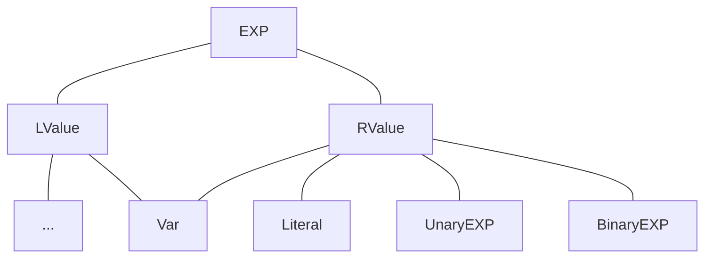

课程需要补齐一下几个函数，调用顺序从上到下依次排列

| 函数 | 文件路径 |
| :-- | :-- |
| void Solver.initializeBackward(CFG\<Node\>, DataflowResult\<Node, Fact\>) | analysis/dataflow/solver/Solver.java |
| SetFact\<Var\> LiveVariableAnalysis.newInitialFact() | analysis/dataflow/analysis/LiveVariableAnalysis.java |
| SetFact\<Var\> LiveVariableAnalysis.newBoundaryFact(CFG\<Stmt\>) | analysis/dataflow/analysis/LiveVariableAnalysis.java |
| void IterativeSolver.doSolveBackward(CFG\<Node\>, DataflowResult\<Node, Fact\>) | analysis/dataflow/solver/IterativeSolver.java |
| void LiveVariableAnalysis.meetInto(SetFact\<Var\>, SetFact\<Var\>) | analysis/dataflow/analysis/LiveVariableAnalysis.java |
| boolean LiveVariableAnalysis.transferNode(Stmt, SetFact\<Var\>, SetFact\<Var\>) | analysis/dataflow/analysis/LiveVariableAnalysis.java |

个人认为该 Lab 内容的难点并非在于思路，而是对项目代码的理解

想要完成这个作业，首先要弄懂这个课设项目提供的的 API，这样你才能在编写代码的时候得心应手

主要的思路还是课上讲的这个公式

$$
\begin{array}{l}
IN[exit]\enspace=\enspace\phi \\
for(each\enspace basic\enspace block\enspace B\backslash exit)\enspace\{\\
\qquad IN[B]\enspace=\enspace \phi\\
\}\\
while(changes\enspace to\enspace any\enspace IN\enspace occur)\enspace\{\\
\qquad for(each\enspace basic\enspace block\enspace B\backslash exit)\enspace\{\\
\qquad \qquad OUT[B]\enspace=\enspace \cup_{S\enspace a\enspace successor\enspace of\enspace B}\enspace IN[S]\\
\qquad \qquad IN[B]\enspace=\enspace use_{B}\enspace\cup\enspace(OUT[B]\enspace-\enspace def_{B})\\
\qquad \}\\
\}
\end{array}
$$

### Solver.initializeBackward

该函数被 `Solver.initialize(CFG<Node> cfg)` 调用

前者依靠 analysis 对象中的 `isForward` 函数判断该算法到底是前向遍历还是后向遍历

判断的依据来源于 `LiveVariableAnalysis.java` 文件中的重载函数

```java
@Override
public boolean isForward() {
    return false;
}
```

下面是该算法的实现

```java
protected void initializeBackward(CFG<Node> cfg, DataflowResult<Node, Fact> result) {
    // TODO - finish me
    for(Node node: cfg.getNodes()) {
        if(cfg.isExit(node)) {
            result.setInFact(node, this.analysis.newBoundaryFact(cfg));
            result.setOutFact(node, this.analysis.newBoundaryFact(cfg));
        }
        else {
            result.setInFact(node, this.analysis.newInitialFact());
            result.setOutFact(node, this.analysis.newInitialFact());
        }
    }
}
```

要注意这里遍历 node 的方式是 `cfg.getNodes()`，而不是 `cfg`

又因为后面要进行 Set 的操作，不初始化 Out 元素在判空上会很麻烦，且初始化也不会明显降低最终代码的性能，所以这里也一并初始化了 Out 元素

### LiveVariableAnalysis.newInitialFact

在该作业中，此函数被后向遍历的函数调用，用于初始化基本的块元素

因为算法要求每个块的初始 IN\[B\] 为 ∅，所以这里直接返回一个空对象

```java
@Override
public SetFact<Var> newInitialFact() {
    // TODO - finish me
    return new SetFact<>();
}
```

### LiveVariableAnalysis.newBoundaryFact

在该作业中，此函数被后向遍历的函数调用，用于初始化 exit 块元素

因为算法要求 exit 块的初始 IN\[exit\] 为 ∅，所以这里直接返回一个空对象

```java
@Override
public SetFact<Var> newBoundaryFact(CFG<Stmt> cfg) {
    // TODO - finish me
    return new SetFact<>();
}
```

### IterativeSolver.doSolveBackward

这一部分是算法核心的主题，也就是 while 循环内，进行 for 遍历的时候要排除掉 exit 块

然后获取相对于当前块 **所有后继块** 的 IN 元素，取并集存入当前块的 OUT 元素中

最后调用转换函数来判断 IN\[B\] 元素是否发生变化，若是有任一元素发生变化，则循环继续

```java
@Override
protected void doSolveBackward(CFG<Node> cfg, DataflowResult<Node, Fact> result) {
    // TODO - finish me
    boolean flag;

    do {
        flag = false;
        for (Node node : cfg.getNodes()) {
            if (cfg.isExit(node)) {
                break;
            }
            // OUT[B] = ∪(IN[S])
            for (Node succ : cfg.getSuccsOf(node)) {
                this.analysis.meetInto(result.getInFact(succ), result.getOutFact(node));
            }
            // IN[B] = use(B) ∪ (OUT[B] - def(B))
            if (this.analysis.transferNode(node, result.getInFact(node), result.getOutFact(node))) {
                flag = true;
            }
        }
    } while (flag);
}
```

### LiveVariableAnalysis.meetInto

代码实现很简单，因为之前把 OUT 元素也全初始化了，所以这里直接用 union 取并集就好了

```java
@Override
public void meetInto(SetFact<Var> fact, SetFact<Var> target) {
    // TODO - finish me
    target.union(fact);
}
```

### LiveVariableAnalysis.transferNode


```java
@Override
public boolean transferNode(Stmt stmt, SetFact<Var> in, SetFact<Var> out) {
    // TODO - finish me
    SetFact<Var> tin = out.copy();
    // def(B)
    if(stmt.getDef().isPresent() && stmt.getDef().get() instanceof Var) {
        tin.remove((Var) stmt.getDef().get());
    }
    // use(B)
    for(RValue rValue: stmt.getUses()) {
        if(rValue instanceof Var) {
            tin.add((Var) rValue);
        }
    }
    // check whether IN[B] has changed
    if(!tin.equals(in)) {
        in.set(tin);
        return true;
	}
    return false;
}
```

这里要注意一件事，因为最后的评判代码调用的是传入进来的参数 in、out 原本的地址上的值

所以我们写代码的时候不要用诸如 `in = out.copy()` 的方式来简化代码，这样并不会修改外部 in 的值

此处 `stmt.getDef()` 获取的是左值，`isPresent` 函数是用来判断左值是否有值（不为空）的，与之相反的判断函数是 `isEmpty`

其次我们需要判断左值和右值的类型是否为 Var，因为根据课程提供的图示来看，并不单单只有 Var 一种类型



若是想打印 IN、OUT 元素的相关信息，可以在其中加入如下代码，让人便于理解

```java
System.out.println("[" + stmt.getIndex() + "@L%02d".formatted(stmt.getLineNumber()) + "]  %20s".formatted(stmt)  
                + ("[%this]".equals(String.valueOf(tin.stream().toList())) ? "" :  
                " ; def --> %10s".formatted(stmt.getDef().isPresent() ? stmt.getDef().get() : "[NULL]")  
                        + " ; OUT[B] --> %10s".formatted(out.stream().toList())  
                        + " ; IN[B]  --> %10s".formatted(in.stream().toList())  
                        + " ; TIN[B] --> %10s".formatted(tin.stream().toList())  
        )  
);
```
