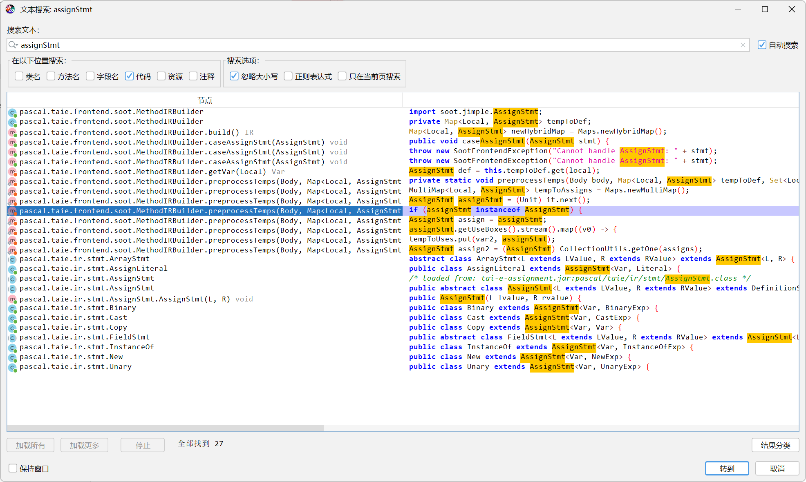
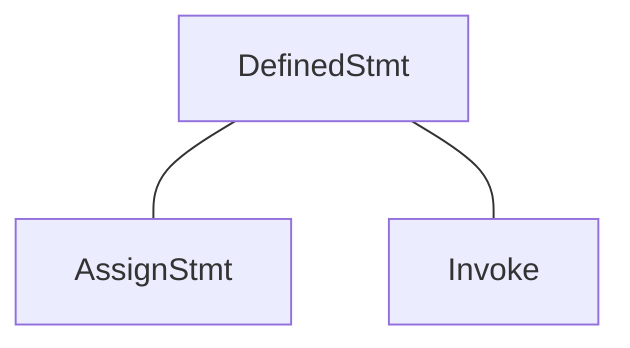
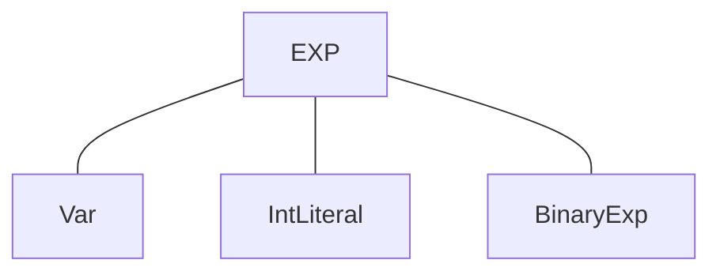
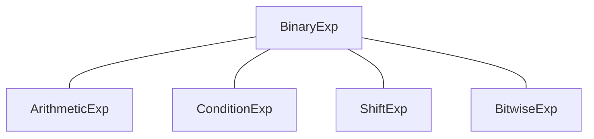
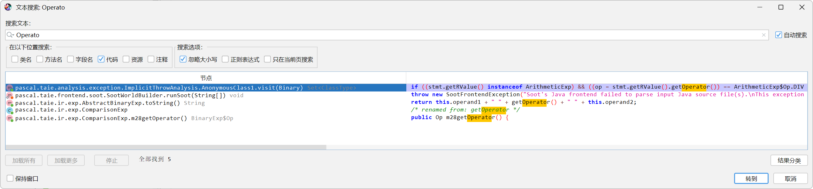

## 笔记部分

- 最大上界和最小下界的理解

考虑偏序集 $(P, \preceq)$ 及其子集 $S \subseteq P$ ，如果 $\forall x\in S, x \preceq u$，我们称 $u\in P$ 是 $S$ 的一个 **上界（Upper Bound）**。类似的，如果 $\forall x\in S, l\preceq x$ ，我们称 $l\in P$ 是 $S$ 的一个 **下界（Lower Bound）**。

也就是说 u 和 l 只是有可能等于偏序集里面的一个子集，在这种情况下：

- u 为最小上界，但大于偏序集里面的所有元素
- l 为最大下界，但小于偏序集里面的所有元素

但是 u 可以更大，l 可以更小，这两个元素只是抽象出来，用于和偏序集里面的元素进行比较，其本身并不受偏序集的定义域制约。

## 作业前言

在该次作业中，无需考虑过程间调用，即我们碰到等号右边为 `method call` 的 IR 时，将这些 `method call` 都看作 NAC

接下来我将会放两个公式图，因为即将采用新的算法，用工作表算法替换之前的迭代算法，为了先保证状态转义方程的正确性，我选择先用迭代算法进行代码设计，后续再采用工作集算法，进行优化改进

### 状态转移方程的相关公式

其中，我们将 $\{(x, \_)\}$ 看作通配符，表示所有以 $x$ 作为第一个元素的有序数对

我们设 $val(o)$ 为 $o$ 的值， 定义 $gen_B$ 如下所示：

- `s: x = c; // c is constant`，则 $gen_s\ =\ \lbrace(x,c)\rbrace$
- `s: x = y;`，则 $gen_s\ =\ \lbrace(x,val(y))\rbrace$
- `s: x = y op z;`，则 $gen_s\ =\ \lbrace(z,f(y,z))\rbrace$，其中
$$
f(y,z)=
\begin{cases}
val(y)\enspace op \enspace val(z) &if\ y\ and\ z\ are\ constants\\
NAC &if\ y\ or\ z\ is\ NAC \\
UNDEF &(NAC\ /\ 0)\ or\ (NAC\ mod\ 0)\ or\ otherwise
\end{cases}
$$

如果 $s$ 不是赋值语句，则 `F : OUT[s] = IN[s]`（恒等函数，不用做任何操作）

### 迭代算法公式

由下方公式可以看出，$IN[B]\enspace-\enspace\lbrace(x, \_)\rbrace$ 其实只是判断有 $IN[B]$ 和 $OUT[B]$ 中是否有相同变量

若是有相同变量 key，那么就删除 Map 数据类型的 $IN[B]$ 中的 key 元素对象即可，但其实我们不用写删除这一步，只需要直接用 $gen_B$ 去更新 $IN[B]$ 即可

真正需要计算 $\lbrace(x, \_)\rbrace$  中 `_`（也就是 $f(y,z)$ 函数）的地方其实是 $gen_B$，这里才是最重要的地方

$$
\begin{array}{l}
OUT[entry]\enspace=\enspace NAC\\
for(each\enspace basic\enspace block\enspace B\backslash entry)\enspace\lbrace\\
\qquad OUT[B]\enspace=\enspace UNDEF\\
\rbrace\\
do\enspace\lbrace\\
\qquad for(each\enspace basic\enspace block\enspace B\backslash entry)\enspace\lbrace\\
\qquad \qquad IN[B]\enspace=\enspace \cup_{P\enspace a\enspace predecessor\enspace of\enspace B}\enspace OUT[P]\\
\qquad \qquad OUT[B]\enspace=\enspace gen_{B}\enspace\cup\enspace(IN[B]\enspace-\enspace\lbrace(x, \_)\rbrace)\\
\qquad \rbrace\\
\rbrace\enspace while(changes\enspace to\enspace any\enspace OUT\enspace occur)
\end{array}
$$

初始化边界是按照实际情况进行的，当分析函数体时，它的形参肯定都是 $NAC$

所以在这里 $OUT[entry]$ 对于形参设置成 $NAC$，而别的变量在这里并没有被定义，所以都为 $UNDEF$

## 作业目录

需要补齐的函数及文件路径（首先要补齐 IterativeSolver 类）

| 函数 | 文件路径 |
| :--- | :--- |
| [void initializeForward(CFG\<Node\>, DataflowResult\<Node, Fact\>)](#solverinitializeforward) | analysis/dataflow/solver/Solver.java |
| [class IterativeSolver\<Node, Fact\> extends Solver<Node, Fact>](#iterativesolver后续用-worklist-算法代替) | analysis/dataflow/solver/IterativeSolver.java |
| [CPFact ConstantPropagation.newBoundaryFact(CFG\<Stmt\>)](#constantpropagationnewboundaryfact) | analysis/dataflow/analysis/constprop/ConstantPropagation.java |
| [CPFact ConstantPropagation.newInitialFact()](#constantpropagationnewinitialfact) | analysis/dataflow/analysis/constprop/ConstantPropagation.java |
| [void ConstantPropagation.meetInto\(CPFact, CPFact\)](#constantpropagationmeetinto) | analysis/dataflow/analysis/constprop/ConstantPropagation.java |
| [Value ConstantPropagation.meetValue\(Value, Value\)](#constantpropagationmeetvalue) | analysis/dataflow/analysis/constprop/ConstantPropagation.java |
| [boolean ConstantPropagation.transferNode(Stmt, CPFact, CPFact)](#constantpropagationtransfernode) | analysis/dataflow/analysis/constprop/ConstantPropagation.java |
| [Value ConstantPropagation.evaluate(Exp, CPFact)](#constantpropagationevaluate) | analysis/dataflow/analysis/constprop/ConstantPropagation.java |
| [class WorkListSolver\<Node, Fact\> extends Solver\<Node, Fact\>](#worklistsolver工作集算法) | analysis/dataflow/solver/WorkListSolver.java |

## 作业实现

### Solver.initializeForward

```java
protected void initializeForward(CFG<Node> cfg, DataflowResult<Node, Fact> result) {
    // TODO - finish me
    cfg.getNodes().forEach(node -> {
        if (cfg.isEntry(node)) {
            result.setInFact(node, this.analysis.newBoundaryFact(cfg));
            result.setOutFact(node, this.analysis.newBoundaryFact(cfg));
        } else {
            result.setInFact(node, this.analysis.newInitialFact());
            result.setOutFact(node, this.analysis.newInitialFact());
        }
    });
}
```

### IterativeSolver（后续用 Worklist 算法代替）

根据作业 A1 补齐即可，注意 A1 是从后往前分析，本作业是从前往后分析

```java
package pascal.taie.analysis.dataflow.solver;

import pascal.taie.analysis.dataflow.analysis.DataflowAnalysis;
import pascal.taie.analysis.dataflow.fact.DataflowResult;
import pascal.taie.analysis.graph.cfg.CFG;

class IterativeSolver<Node, Fact> extends Solver<Node, Fact> {

    public IterativeSolver(DataflowAnalysis<Node, Fact> analysis) {
        super(analysis);
    }

    @Override
    protected void doSolveForward(CFG<Node> cfg, DataflowResult<Node, Fact> result) {
        boolean flag;

        do {
            flag = false;
            for (Node node : cfg.getNodes()) {
                if (cfg.isEntry(node)) {
                    continue;
                }
                // IN[B] = ∪(OUT[P])
                for (Node pred : cfg.getPredsOf(node)) {
                    this.analysis.meetInto(result.getOutFact(pred), result.getInFact(node));
                }
                // OUT[B] = gen(B) ∪ (IN[B] - {(x, _)})
                if (this.analysis.transferNode(node, result.getInFact(node), result.getOutFact(node))) {
                    flag = true;
                }
            }
        } while (flag);
    }

    @Override
    protected void doSolveBackward(CFG<Node> cfg, DataflowResult<Node, Fact> result) {
        throw new UnsupportedOperationException();
    }
}
```

### ConstantPropagation.newBoundaryFact

此处需要区分两个函数，举个例子：

```java
int nac(int p) {
    int x = 1, y = p;
    int z = x * y;
    return z;
}
```

- `cfg.getIR().getParams()`：获取的是 CFG **初始基块**的变量，也就是当前分析的函数的**参数**，此处为变量 `p`
- `cfg.getIR().getVars()`：获取的是该 CFG **内部基块**的变量，此处有 `x`、`y`、`z`

因为参数变量肯定不是未定义的，但我们不能一上来就确认它是个常量（大概率都不是常量），所以我们将其初始化为 NAC

并且为了严格判断我们要分析的变量仅为能转化为 int 类型的数据，要加上 `canHoldInt` 函数对其进行判断

```java
@Override
public CPFact newBoundaryFact(CFG<Stmt> cfg) {
    // TODO - finish me
    CPFact cpFact = new CPFact();
    cfg.getIR().getParams().forEach((param) -> {
        if (canHoldInt(param)) {
            cpFact.update(param, Value.getNAC());
        }
    });
    return cpFact;
}
```

### ConstantPropagation.newInitialFact

但我们不清楚基块内部的变量状态，所以内部都要初始化为 UNDEF

```java
@Override
public CPFact newInitialFact() {
    // TODO - finish me
    return new CPFact();
}
```

### ConstantPropagation.meetInto

两个 Fact 作交集，相同的变量要作细致的处理，这里用 meetValue 进行处理

不同的变量直接合并即可，不需要操作任何东西

```java
@Override
public void meetInto(CPFact fact, CPFact target) {
    // TODO - finish me
    fact.forEach((key, value) -> {
        // 变量名相同时需要计算变量合并后的结果
        if (target.keySet().contains(key)) {
            target.update(key, meetValue(value, target.get(key)));
        } else {
            target.update(key, value);
        }
    });
}
```

### ConstantPropagation.meetValue

- 若有一个变量是 `UNDEF`，则变量交集状态由另一个变量控制
- 若是两个变量都为常数且相等，则变量交集状态为常量
- 剩余的变量交集状态都是 `NAC`

```java
public Value meetValue(Value v1, Value v2) {
    // TODO - finish me
    if (v1.isUndef()) {
        return v2;
    } else if (v2.isUndef()) {
        return v1;
    } else if (v1.isConstant() && v2.isConstant() && v1.getConstant() == v2.getConstant()) {
        return v1;
    } else {
        return Value.getNAC();
    }
}
```

### ConstantPropagation.transferNode

此处是常量传播的状态转义方程，需要实现的公式如下

$$
\begin{array}{l}
OUT[B]\enspace=\enspace gen_{B}\enspace\cup\enspace(IN[B]\enspace-\enspace\lbrace(x, \_)\rbrace)
\end{array}
$$


这一部分是重点，$gen_{B}$ 的生成需要满足上方列举的 [状态转移方程的相关公式](#状态转移方程的相关公式)

虽说本作业只考虑整数类型的赋值语句，但是我们首先就会遇到两个问题：

- 怎么判断这个语句的作用是赋值
- 怎么获取这个语句里的数值和运算符（在 `ConstantPropagation.evaluate` 中介绍）

这里我利用 JADX 工具来解决这个问题，首先赋值的单词是 Assign，可以很快找到赋值语句的判断方式



于是我们发现，可以用该句式来确定当前语句是否为赋值语句（下面会改动该句）

```java
if (stmt instanceof DefinitionStmt<?, ?> definitionStmt) {
    // definitionStmt ...
}
```

下面将列出一些注意事项

**因为程序中有可能左值为空（没有生成任何值），但他仍然是一个赋值语句**

**这种时候我们要判断一下左值的类型是否为变量，所以判断句式应改为**

```java
if (stmt instanceof DefinitionStmt<?, ?> definitionStmt) {
    LValue lValue = definitionStmt.getLValue();
    if (lValue instanceof Var def && canHoldInt(def)){
    // ...
    }
}
```

对于赋值语句，不能用 `AssignStmt` 类来判断，要用 `DefinedStmt` 类来进行判断，原因如下



可以看到，还有一个 `Invoke`（方法调用）类，那么根据算法，我们可以得到如下代码

```java
@Override
public boolean transferNode(Stmt stmt, CPFact in, CPFact out) {
    // TODO - finish me
    CPFact tout = out.copy();
    in.forEach(out::update);
    if (stmt instanceof DefinitionStmt<?, ?> definitionStmt) {
        // OUT[B] = gen[B] ∪ (IN[B] - {(x, _)})
        LValue lValue = definitionStmt.getLValue();
        if (lValue instanceof Var def && canHoldInt(def)) {
            Exp exp = definitionStmt.getRValue();
            out.update(def, evaluate(exp, in));
        }
    }
    return !tout.equals(out);
}
```

有的读者会有疑惑，之前在 A1 实验中，LiveVariableAnalysis 里要寻找的 def 要求之前没有被定义


### ConstantPropagation.evaluate

判断变量、`int` 型常量以及二元表达式的方式，我们可以由作业中的该图得知



但是注意，本作业不是只关注 int 类型的变量，而是一切能以 int 变量类型存储的变量

也就是说，诸如 boolean、short 也是可以的， 我们可以用工具函数 `canHoldInt` 来判断

接着要解决获取该语句中数值和运算符的问题，我们先看下图



现在搜索操作的英文单词 Operator，可以看到有获取操作运算符的方式



继而可以得知 `getOperator` 函数来源于 `ArithmeticExp` 类的父类 `BinaryExp`

但父类只实现了 `Op`（操作符）类的接口，其实现在于子类

于是，我们可以明确知道，获取操作数和运算符的方式可以如下所示

```java
BinaryExp binaryExp = (BinaryExp) exp;
Value op1 = in.get(binaryExp.getOperand1());
Value op2 = in.get(binaryExp.getOperand2());
Op op = binaryExp.getOperator();
```

要注意我们需要判断 `NAC / 0` 和 `NAC % 0` 的操作，此时得到的数据为 `UNDEF`

还要注意判断 `UNDEF` 变量，`UNDEF` 和谁操作都是 `UNDEF`

**注：重点来了，这里是我在 PASCAL OJ 上一直 WA 的原因，其实这里的意思是 `x / 0` 和 `x % 0` 都为 `UNDEF`，`x` 可以是 `NAC`，但也可能是其他表达式（EXP）**

```java
public static Value evaluate(Exp exp, CPFact in) {
    // TODO - finish me
    if (exp instanceof Var var) {
        // 此处变量肯定是存在于 Map 中了，一般不会出现赋值未定义的变量的情况
        // 变量是否能以 int 类型存储在 transferNode 中已作判断
        return in.get(var);
    } else if (exp instanceof IntLiteral intLiteral) {
        // 若是常量，新增或是更新 Map 中的值即可，直接用 update 即可
        return Value.makeConstant(intLiteral.getValue());
    } else if (exp instanceof BinaryExp binaryExp) {
        // 二元表达式一律由下方函数处理
        Value op1 = in.get(binaryExp.getOperand1());
        Value op2 = in.get(binaryExp.getOperand2());
        // 设置 除/模 0 的操作结果为 UNDEF
        if (exp instanceof ArithmeticExp arithmeticExp && switch (arithmeticExp.getOperator()) {
            case DIV, REM -> op2.isConstant() && op2.getConstant() == 0;
            default -> false;
        }) {
            return Value.getUndef();
        }
        if (op1.isConstant() && op2.isConstant()) {
            int opInt1 = op1.getConstant();
            int opInt2 = op2.getConstant();
            if (exp instanceof ArithmeticExp arithmeticExp) {
                return Value.makeConstant(switch (arithmeticExp.getOperator()) {
                    case ADD -> opInt1 + opInt2;
                    case SUB -> opInt1 - opInt2;
                    case MUL -> opInt1 * opInt2;
                    case DIV -> opInt1 / opInt2;
                    case REM -> opInt1 % opInt2;
                });
            }
            if (exp instanceof ConditionExp conditionExp) {
                return Value.makeConstant(switch (conditionExp.getOperator()) {
                    case EQ -> opInt1 == opInt2;
                    case NE -> opInt1 != opInt2;
                    case LT -> opInt1 < opInt2;
                    case GT -> opInt1 > opInt2;
                    case LE -> opInt1 <= opInt2;
                    case GE -> opInt1 >= opInt2;
                } ? 1 : 0);
            } else if (exp instanceof ShiftExp shiftExp) {
                return Value.makeConstant(switch (shiftExp.getOperator()) {
                    case SHL -> opInt1 << opInt2;
                    case SHR -> opInt1 >> opInt2;
                    case USHR -> opInt1 >>> opInt2;
                });
            } else if (exp instanceof BitwiseExp bitwiseExp) {
                return Value.makeConstant(switch (bitwiseExp.getOperator()) {
                    case OR -> opInt1 | opInt2;
                    case AND -> opInt1 & opInt2;
                    case XOR -> opInt1 ^ opInt2;
                });
            }
        } else if (op1.isNAC() || op2.isNAC()) {
            // 前面已经判断过 除/模 0 的情况了
            return Value.getNAC();
        } else {
            return Value.getUndef();
        }
    }
    return Value.getNAC();
}
```

### WorkListSolver（工作集算法）

到了这里，说明以上构造的常量传播算法已然能够通过作业中全部的测试用例

下面，我们将使用 `WorkList`（工作集）算法来更替上面的迭代算法

先看算法公式，此为从前往后分析的工作集算法

$$
\begin{array}{l}
OUT[entry]\enspace=\enspace \phi\\
for(each\enspace basic\enspace block\enspace B\backslash entry)\enspace\lbrace\\
\qquad OUT[B]\enspace=\enspace \phi\\
\rbrace\\
Worklist \leftarrow a\enspace Set\enspace of\enspace all\enspace basic\enspace blocks\\
while(Worklist\enspace is\enspace not\enspace empty)\enspace\lbrace\\
\qquad Pick\enspace a\enspace basic\enspace block\enspace B\enspace from\enspace Worklist\\
\qquad old\_OUT\enspace=\enspace OUT[B]\\
\qquad IN[B]\enspace=\enspace \cup_{P\enspace a\enspace predecessor\enspace of\enspace B}\enspace OUT[P]\\
\qquad OUT[B]\enspace=\enspace gen_{B}\enspace\cup\enspace(IN[B]\enspace-\enspace kill[B])\\
\qquad if(old\_OUT\enspace\ne\enspace OUT[B])\enspace\lbrace\\
\qquad \qquad Add\enspace all\enspace successors\enspace of\enspace B\enspace to\enspace Worklist\\
\qquad\rbrace\\
\rbrace
\end{array}
$$

常量传播的工作集算法公式只需要做出一点改动，算法公式如下

$$
\begin{array}{l}
OUT[entry]\enspace=\enspace NAC\\
for(each\enspace basic\enspace block\enspace B\backslash entry)\enspace\lbrace\\
\qquad OUT[B]\enspace=\enspace UNDEF\\
\rbrace\\
Worklist \leftarrow a\enspace Set\enspace of\enspace all\enspace basic\enspace blocks\\
while(Worklist\enspace is\enspace not\enspace empty)\enspace\lbrace\\
\qquad Pick\enspace a\enspace basic\enspace block\enspace B\enspace from\enspace Worklist\\
\qquad old\_OUT\enspace=\enspace OUT[B]\\
\qquad IN[B]\enspace=\enspace \cup_{P\enspace a\enspace predecessor\enspace of\enspace B}\enspace OUT[P]\\
\qquad OUT[B]\enspace=\enspace gen_{B}\enspace\cup\enspace(IN[B]\enspace-\enspace\lbrace(x, \_)\rbrace)\\
\qquad if(old\_OUT\enspace\ne\enspace OUT[B])\enspace\lbrace\\
\qquad \qquad Add\enspace all\enspace successors\enspace of\enspace B\enspace to\enspace Worklist\\
\qquad\rbrace\\
\rbrace
\end{array}
$$

下面是算法实现

```java
package pascal.taie.analysis.dataflow.solver;

import pascal.taie.analysis.dataflow.analysis.DataflowAnalysis;
import pascal.taie.analysis.dataflow.fact.DataflowResult;
import pascal.taie.analysis.graph.cfg.CFG;

import java.util.LinkedList;
import java.util.Queue;

class WorkListSolver<Node, Fact> extends Solver<Node, Fact> {

    WorkListSolver(DataflowAnalysis<Node, Fact> analysis) {
        super(analysis);
    }

    @Override
    protected void doSolveForward(CFG<Node> cfg, DataflowResult<Node, Fact> result) {
        // TODO - finish me
        Queue<Node> worklist = new LinkedList<Node>(cfg.getNodes());
        while (!worklist.isEmpty()) {
            Node node = worklist.poll();
            for (Node pred : cfg.getPredsOf(node)) {
                this.analysis.meetInto(result.getOutFact(pred), result.getInFact(node));
            }
            if (this.analysis.transferNode(node, result.getInFact(node), result.getOutFact(node))) {
                worklist.addAll(cfg.getSuccsOf(node));
            }
        }
    }

    @Override
    protected void doSolveBackward(CFG<Node> cfg, DataflowResult<Node, Fact> result) {
        throw new UnsupportedOperationException();
    }
}
```