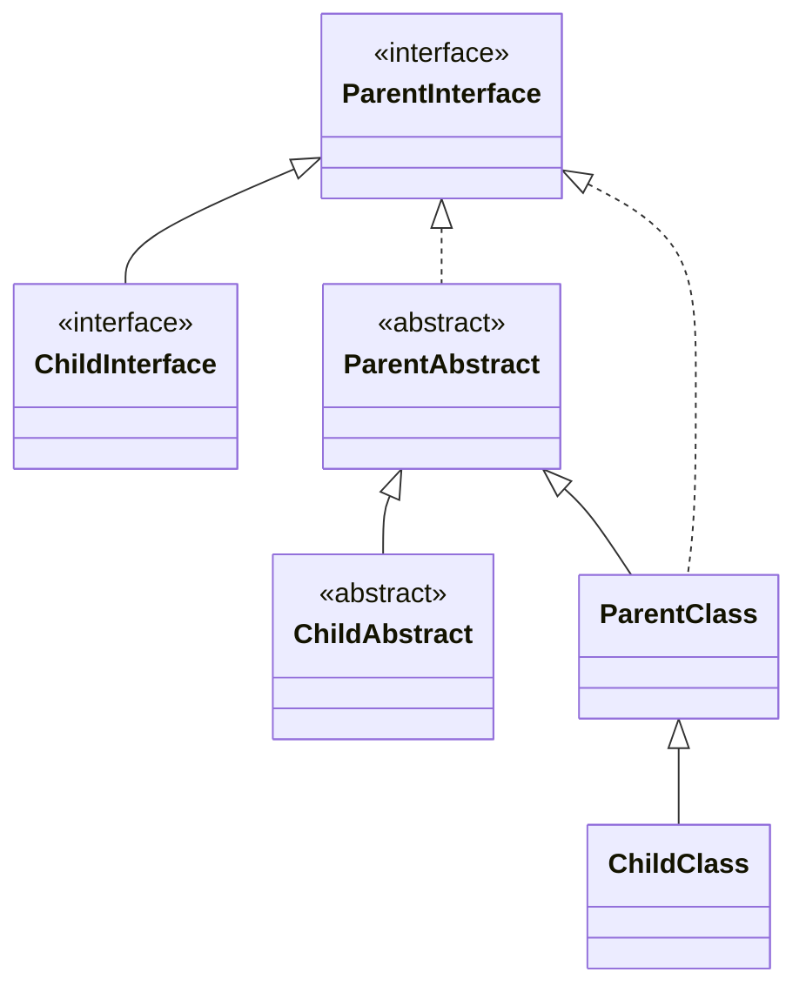
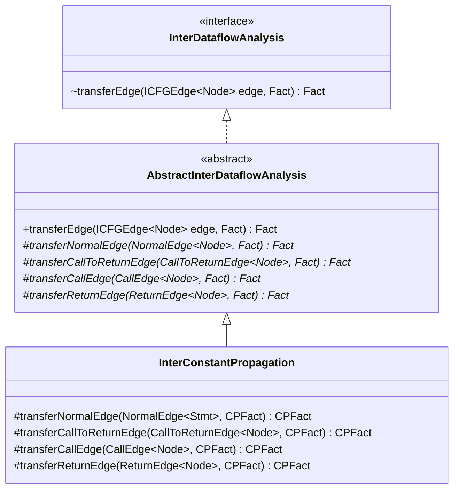
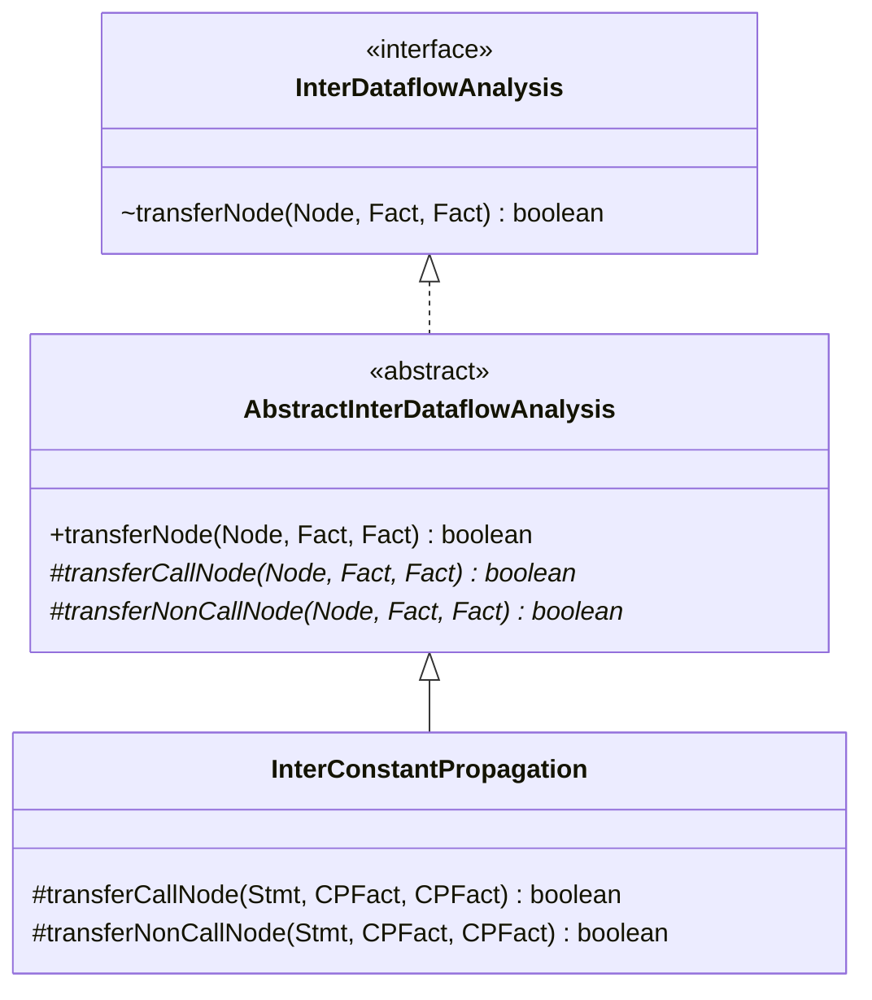

## 笔记部分

> 一个方法的 **描述符（Descriptor）** 由这个方法的 **返回类型（Return Type）** 和 **形参类型（Parameter Type）** 组成。

> 一个方法的 **签名（Signature）** 由这个方法所在的 **类名（Class Type）** ，方法本身的 **方法名（Method Name）** 以及方法的 **描述符（Descriptor）** 组成。签名可以用作一个方法的 **标识符（Identifier）** 。

考虑如下的实例方法：

```java
class C {
    T foo(P p, Q q, R r) { ... }
}
```
> 上述方法的签名为 `<C: T foo(P, Q, R)>` ，其中 `C` 是类名， `T` 是返回类型， `(P, Q, R)` 是形参类型， `foo` 是方法名。在不产生歧义的前提下，方法签名可以简写为 `C.foo(P, Q, R)` 。

### 虚调用的方法派发算法

c 是一个类的定义，m 是一个方法。如果能在本类中找到 name 和 descriptor 一致的方法，则调用 c 的方法，否则到父类中寻找

$$
\begin{array}{l}
Dispatch(c,m)\enspace\lbrace\\
\qquad if\enspace c\ contains\ non\text{-}abstract\ method\ m'\\
\qquad that\ has\ the\ same\ name\ and\ descripter\ of\ m\enspace\lbrace\\
\qquad\qquad return\enspace m'\\
\qquad\rbrace\\
\qquad else \enspace\lbrace\\
\qquad\qquad //\ where\ c'\ is\ super\ class\ of\ c\\
\qquad\qquad return\enspace Dispatch(c',m)\\
\qquad\rbrace\\
\rbrace
\end{array}
$$

### CHA 算法

- `call site(cs)` 就是调用语句，`m(method)` 就是对应的函数签名
- T 集合中保存找到的结果
  1. 三个 if 分支分别对应之前提到的 Java 中的三种 call 类型 Static call（所有的静态方法调用）
  2. Special call（使用 super 关键字的调用，构造函数调用 和 Private instance method）
  3. Virtual call（其他所有调用）

$$
\begin{array}{l}
Resolve(cs)\enspace\lbrace\\
\qquad T\enspace=\enspace\lbrace \rbrace\\
\qquad m\enspace=\enspace method\ signature\ at\ cs\\
\qquad if\enspace cs\enspace is\enspace a\ static\ call\enspace then\\
\qquad\qquad T\enspace =\enspace \lbrace m\rbrace\\
\qquad if\enspace cs\enspace is\enspace a\ special\ call\enspace then\enspace\lbrace\\
\qquad\qquad c^m\enspace=\enspace class\ type\ of\ m\\
\qquad\qquad T\enspace=\enspace\lbrace\enspace Dispatch(c^m,m)\enspace\rbrace\\
\qquad\rbrace \\
\qquad if\enspace cs\enspace is\enspace a\ virtual\ call\enspace then\enspace\lbrace\\
\qquad\qquad c\enspace=\enspace declared\ type\ of\ receiver\ variable\ at\ cs\\
\qquad\qquad foreach\enspace c'\ that\ is\ a\ subclass\ of\ c\ or\ c\ itself\enspace do\\
\qquad\qquad\qquad add\enspace Dispatch(c',m)\enspace to\enspace T\\
\qquad\rbrace \\
\qquad return\enspace T\\
\rbrace
\end{array}
$$

- 静态方法调用：因为静态方法调用不涉及 class 类型，所以可以直接返回 m
- 特殊方法调用：直接将 class 和 m 的函数签名传参至 Dispatch 函数中
- 虚拟方法调用：此处 m 的 class 类型属于左值（被赋值变量/声明变量）的类型，无论右值 new 的类是什么，都要遍历所有的子类（不包括孙子类）并加上自身去执行 Dispatch 函数

### 调用图构建算法

$$
\begin{array}{l}
BuildCallGraph(m^{entry})\enspace\\
\qquad WL\enspace=\enspace\lbrack m^{entry}\rbrack\quad//\ Work\ List,\ containing\ the\ methods\ to\ be\ processed\\
\qquad CG\enspace=\enspace\lbrace\ \rbrace\qquad\quad//\ Call\ Graph,\ a\ set\ of\ call\ edges\\
\qquad RM\enspace=\enspace\lbrace\ \rbrace\qquad\quad//\ A\ set\ of\ reachable\ methods\\
\qquad while\enspace WL\enspace is\enspace not\enspace empty\enspace do\\
\qquad\qquad remove\enspace m\enspace from\enspace WL\\
\qquad\qquad if\enspace m \notin RM\enspace then\\
\qquad\qquad\qquad add\enspace m\enspace to \enspace RM \\
\qquad\qquad\qquad foreach\enspace call\ site\ cs\enspace in\enspace m\enspace do\\
\qquad\qquad\qquad\qquad T\enspace=\enspace Resolve(cs)\\
\qquad\qquad\qquad\qquad foreach\enspace target\ method\ m'\enspace in\enspace T\enspace do\\
\qquad\qquad\qquad\qquad\qquad add\enspace cs\rightarrow m'\enspace to\enspace CG\\
\qquad\qquad\qquad\qquad\qquad add\enspace m'\enspace to\enspace WL
\end{array}
$$

### 过程间常量传播

- 调用边 transfer：传递参数
- 返回边 transfer：传递返回值
- 节点 transfer：在之前的基础上，多加一条规则
  - 对于每个包含调用点的 Stmt，其 OutFact 生成时需要删掉左值，因为调用点的返回边会连接至下一个 Stmt，而不是该 Stmt

## 作业目录

### 常量传播目录

| 函数                                                                                                                | 文件路径                                                          |
| :---------------------------------------------------------------------------------------------------------------- | :------------------------------------------------------------ |
| [ConstantPropagation.newBoundaryFact(CFG\<Stmt\>)](../A2/README.md#constantpropagationnewboundaryfact)            | analysis/dataflow/analysis/constprop/ConstantPropagation.java |
| [CPFact ConstantPropagation.newInitialFact()](../A2/README.md#constantpropagationnewinitialfact)                  | analysis/dataflow/analysis/constprop/ConstantPropagation.java |
| [void ConstantPropagation.meetInto\(CPFact, CPFact\)](../A2/README.md#constantpropagationmeetinto)                | analysis/dataflow/analysis/constprop/ConstantPropagation.java |
| [Value ConstantPropagation.meetValue\(Value, Value\)](../A2/README.md#constantpropagationmeetvalue)               | analysis/dataflow/analysis/constprop/ConstantPropagation.java |
| [boolean ConstantPropagation.transferNode(Stmt, CPFact, CPFact)](../A2/README.md#constantpropagationtransfernode) | analysis/dataflow/analysis/constprop/ConstantPropagation.java |
| [Value ConstantPropagation.evaluate(Exp, CPFact)](../A2/README.md#constantpropagationevaluate)                    | analysis/dataflow/analysis/constprop/ConstantPropagation.java |

### 类层次结构分析目录（本章）

| 函数                                                                                | 文件路径                                     |
| :-------------------------------------------------------------------------------- | :--------------------------------------- |
| [CallGraph\<Invoke, JMethod\> buildCallGraph(JMethod)](#chabuilderbuildcallgraph) | analysis/graph/callgraph/CHABuilder.java |
| [Set\<JMethod\> resolve(Invoke callSite)](#chabuilderresolve)                     | analysis/graph/callgraph/CHABuilder.java |
| [JMethod dispatch(JClass, Subsignature)](#chabuilderdispatch)                     | analysis/graph/callgraph/CHABuilder.java |

### 过程间常量传播目录（本章）

| 函数                                                                                                                     | 文件路径                                                  |
| :--------------------------------------------------------------------------------------------------------------------- | :---------------------------------------------------- |
| [void initialize()](#intersolverinitialize)                                                                            | analysis/dataflow/inter/InterSolver.java              |
| [void doSolve()](#intersolverdosolve)                                                                                  | analysis/dataflow/inter/InterSolver.java              |
| [CPFact transferNormalEdge(NormalEdge\<Stmt\>, CPFact)](#interconstantpropagationtransfernormaledge)                   | analysis/dataflow/inter/InterConstantPropagation.java |
| [CPFact transferCallToReturnEdge(CallToReturnEdge\<Stmt\>, CPFact)](#interconstantpropagationtransfercalltoreturnedge) | analysis/dataflow/inter/InterConstantPropagation.java |
| [CPFact transferCallEdge(CallEdge\<Stmt\>, CPFact)](#interconstantpropagationtransfercalledge)                         | analysis/dataflow/inter/InterConstantPropagation.java |
| [CPFact transferReturnEdge(ReturnEdge\<Stmt\>, CPFact)](#interconstantpropagationtransferreturnedge)                   | analysis/dataflow/inter/InterConstantPropagation.java |
| [boolean transferCallNode(Stmt, CPFact, CPFact)](#interconstantpropagationtransfercallnode)                            | analysis/dataflow/inter/InterConstantPropagation.java |
| [boolean transferNonCallNode(Stmt, CPFact, CPFact)](#interconstantpropagationtransfernoncallnode)                      | analysis/dataflow/inter/InterConstantPropagation.java |

## 类层次结构分析作业实现

### CHABuilder.buildCallGraph

标准的调用图构建算法，没有什么要讲解的地方

```java
private CallGraph<Invoke, JMethod> buildCallGraph(JMethod entry) {
    DefaultCallGraph callGraph = new DefaultCallGraph();
    callGraph.addEntryMethod(entry);
    // TODO - finish me
    Queue<JMethod> workList = new LinkedList<>();
    workList.add(entry);
    while (!workList.isEmpty()) {
        JMethod jMethod = workList.poll();
        System.out.println("Start: " + jMethod);
        if (!callGraph.contains(jMethod)) {
            callGraph.addReachableMethod(jMethod);
            for (Invoke callSite : callGraph.getCallSitesIn(jMethod)) {
                System.out.println("callSite: " + callSite);
                Set<JMethod> T = resolve(callSite);
                CallKind callKind = CallGraphs.getCallKind(callSite);
                for (JMethod target : T) {
                    callGraph.addEdge(new Edge<>(callKind, callSite, target));
                    workList.add(target);
                    System.out.println("workList: " + workList);
                }
            }
        }
    }
    return callGraph;
}
```

### CHABuilder.resolve

因为 `methodRef` 默认获取的函数对象中的 class 为左值的 class，而非右值中 new 的 class，所以我们不用担忧如何获取左值的 class 的类型

需要注意的地方是对于接口类型的处理，因为我们要获取的是直接或者间接的子类（是否为实例类由 Dispatch 算法处理），所以我们要先用 BFS 来获取所有可达的接口，再分别判断是否有直接子类

**遇到的错误及解决方案**

> Your submission correctly analyzes 84 out of 85 call sites in test cases for CHA

Java 的接口、类、抽象类关系可能如下



- **错误代码定位**

可以看出我是直接将关系为 Implement 的 Class 都扔到了 **可达类集合** 中，但是这个 Class 是有可能是接口类型的

```java
while (!workList.isEmpty()) {  
    jClass = workList.poll();  
    jClasses.addAll(hierarchy.getDirectImplementorsOf(jClass));  
    workList.addAll(hierarchy.getDirectSubinterfacesOf(jClass));  
}
```

还有一点是，resolve 的算法中的获取子类指的不仅仅是直接子类，还有间接子类，所以要暴力枚举

**最终代码**

```java
private Set<JMethod> resolve(Invoke callSite) {
    // TODO - finish me
    Set<JMethod> T = new HashSet<>();
    MethodRef methodRef = callSite.getMethodRef();
    JClass jClass = methodRef.getDeclaringClass();
    Subsignature methodSubsignature = methodRef.getSubsignature();
    switch (CallGraphs.getCallKind(callSite)) {
        case STATIC -> T.add(jClass.getDeclaredMethod(methodSubsignature));
        case SPECIAL -> {
            JMethod jMethod = dispatch(jClass, methodSubsignature);
            if (jMethod != null) {
                T.add(jMethod);
            }
        }
        case VIRTUAL, INTERFACE -> {
            Queue<JClass> workList = new LinkedList<>();
            workList.add(jClass);
            while (!workList.isEmpty()) {
                jClass = workList.poll();
                if (jClass.isInterface()) {
                    // 反正加空集合也没啥事，不判断了
                    workList.addAll(hierarchy.getDirectImplementorsOf(jClass));
                    workList.addAll(hierarchy.getDirectSubinterfacesOf(jClass));
                } else {
                    JMethod jMethod = dispatch(jClass, methodSubsignature);
                    if (jMethod != null) {
                        T.add(jMethod);
                    }
                    workList.addAll(hierarchy.getDirectSubclassesOf(jClass));
                }
            }
        }
    }
    return T;
}
```

### CHABuilder.dispatch

标准的 Dispatch 算法，判断一下是否为抽象类

```java
private JMethod dispatch(JClass jclass, Subsignature subsignature) {
    // TODO - finish me
    for (JMethod jMethod : jclass.getDeclaredMethods()) {
        if (jMethod.getSubsignature().equals(subsignature) && !jMethod.isAbstract()) {
            return jMethod;
        }
    }
    // 没有相关函数的，直接找父类
    JClass superClass = jclass.getSuperClass();
    if (superClass != null) {
        return dispatch(superClass, subsignature);
    }
    // 若是遍历到了最后，也就是到了 Object 类，它没有父类，返回 null
    return null;
}
```

## 过程间常量传播作业实现

> 吐槽，又是纯思路无算法的作业，开始折磨

此处是过程间常量传播的状态转义方程，需要实现的公式如下

$$
IN\lbrack B\rbrack\enspace=\enspace\bigcup_{P\enspace a\ predecessor\ of\enspace B} transferEdge(P\rightarrow B,OUT\lbrack P\rbrack)
$$

这部分函数挺多的，先记录一下函数之间的关系

### InterSolver.initialize

初始化变量部分，和之前过程内的常量传播的初始化相比，多了一步：要对每个函数的入口节点做边界初始化

```java
private void initialize() {
    // TODO - finish me
    for (Node node : this.icfg.getNodes()) {
        this.result.setInFact(node, this.analysis.newInitialFact());
        this.result.setOutFact(node, this.analysis.newInitialFact());
    }
    // 这里获取所有函数方法的起始语句
    for (Method method : this.icfg.entryMethods().toList()) {
        Node entry = this.icfg.getEntryOf(method);
        this.result.setOutFact(entry, this.analysis.newBoundaryFact(entry));
    }
}
```

### InterSolver.doSolve

和过程内常量传播相比，此处的求解器修改了求 inFact\[B\] 的过程（公式不一样了）

```java
private void doSolve() {
    // TODO - finish me
    this.workList = new LinkedList<>(icfg.getNodes());
    while (!workList.isEmpty()) {
        Node node = workList.poll();
        Set<ICFGEdge<Node>> inICFGEdges = icfg.getInEdgesOf(node);
        for (Node pred : icfg.getPredsOf(node)) {
            // transferEdge
            for (ICFGEdge<Node> inICFGEdge : inICFGEdges) {
                if (inICFGEdge.getSource().equals(pred)) {
                    analysis.meetInto(analysis.transferEdge(inICFGEdge, result.getOutFact(pred)), result.getInFact(node));
                    break;
                }
            }
            // 不存在前驱节点和当前节点没有边的情况
        }
        // transferNode: 需要判断是否有调用点
        if (analysis.transferNode(node, result.getInFact(node), result.getOutFact(node))) {
            workList.addAll(icfg.getSuccsOf(node));
        }
    }
}
```

### transferEdge 相关

#### transferEdge 调用关系

transferEdge 相关函数的基础类图如下



其中，`AbstractInterDataflowAnalysis` 抽象类中的 transferEdge 函数调用了如下四个函数

- transferNormalEdge
- transferCallToReturnEdge
- transferCallEdge
- transferReturnEdge

所以我们只需要考虑如何实现上面四个函数，以及如何在合适的位置使用 transferEdge 函数

#### InterConstantPropagation.transferNormalEdge

正常的边传递没有多余的处理，只要记得本次作业不要修改 outFact 即可

```java
@Override
protected CPFact transferNormalEdge(NormalEdge<Stmt> edge, CPFact out) {
    // TODO - finish me
    return out.copy();
}
```

#### InterConstantPropagation.transferCallToReturnEdge

CALL → RETURN 的边状态转移要记得在 outFact 中 kill 掉被赋值的变量

```java
@Override
protected CPFact transferCallToReturnEdge(CallToReturnEdge<Stmt> edge, CPFact out) {
    // TODO - finish me
    // 记住不要修改 out 参数
    CPFact tmpOut = out.copy();
    // 存在只调用函数，却没有赋值的情况
    edge.getSource().getDef().ifPresent(lValue -> tmpOut.remove((Var) lValue));
    return tmpOut;
}
```

#### InterConstantPropagation.transferCallEdge

这里要记得映射参数变量名，从调用点的 args 变为被调用函数的 params

```java
@Override
protected CPFact transferCallEdge(CallEdge<Stmt> edge, CPFact callSiteOut) {
    // TODO - finish me
    // 记住不要修改 out 参数
    CPFact tmpOut = new CPFact();
    // 获取 CallSite 的参数，将这些参数的常量值传递给下一个方法
    IR calleeIR = edge.getCallee().getIR();
    if (edge.getSource() instanceof Invoke callSite) {
        for (int i = 0; i < calleeIR.getParams().size(); i++) {
            tmpOut.update(calleeIR.getParam(i), callSiteOut.get(callSite.getInvokeExp().getArg(i)));
        }
    }
    return tmpOut;
}
```

#### InterConstantPropagation.transferReturnEdge

这里要考虑有多个 return 语句的情况，如果每个返回值都相等，那么这个函数就能返回一个常量值，否则返回 NAC

```java
@Override
protected CPFact transferReturnEdge(ReturnEdge<Stmt> edge, CPFact returnOut) {
    // TODO - finish me
    // 记住不要修改 out 参数
    CPFact tmpOut = new CPFact();
    // 映射返回变量到调用者的左值变量上
    // 返回值如果是形如 return y + 20; 的，IR 会将其合并成一个 temp 变量，不用做 cp.evaluate 处理
    Optional<LValue> optionalLValue = edge.getCallSite().getDef();
    // 需要考虑多个 return 的情况，按变量名来过滤，如果有不一样就返回 NAC
    boolean changed = true;
    // java 的返回参数只有一个，考虑值是否相等即可，不用考虑变量名
    Value cmpValue = null;
    if (optionalLValue.isPresent()) {
        for (Var returnVar : edge.getReturnVars()) {
            if (cmpValue == null) {
                cmpValue = returnOut.get(returnVar);
            } else {
                changed &= cmpValue.equals(returnOut.get(returnVar));
            }
        }
        // 其实按道理已经不会等于 null 了，只是 IDE 不能识别，兼容一下 IDE
        if (changed && cmpValue != null) {
            tmpOut.update((Var) optionalLValue.get(), cmpValue);
        } else {
            tmpOut.update((Var) optionalLValue.get(), Value.getNAC());
        }
    }
    return tmpOut;
}
```

### transferNode 相关

#### transferNode 调用关系

transferNode 相关函数的基础类图如下



其中，`AbstractInterDataflowAnalysis` 抽象类中的 transferNode 函数调用了如下两个函数

- transferCallNode
- transferNonCallNode

所以我们只需要考虑如何实现上面两个函数，以及如何在合适的位置使用 transferNode 函数

#### InterConstantPropagation.transferCallNode

该函数处理的是 CallSite（调用点）的状态转移

由于其 outFact 对下一个 Stmt 造成影响的操作由 2 个边状态转移函数解决：
- transferCallToReturnEdge
- transferCallEdge
所以此处不需要做额外处理，只需要将将 inFact 赋值给 outFact 即可
 
```java
@Override
protected boolean transferCallNode(Stmt stmt, CPFact in, CPFact out) {
    // TODO - finish me
    // 对于 in 的处理，都由 transferCallEdge 处理完毕了
    return out.copyFrom(in);
}
```

#### InterConstantPropagation.transferNonCallNode

该部分直接调用 **过程内常量传播** 的代码即可，不涉及过程间的常量传播，无须多加考虑

```java
@Override
protected boolean transferNonCallNode(Stmt stmt, CPFact in, CPFact out) {
    // TODO - finish me
    return cp.transferNode(stmt, in, out);
}
```
