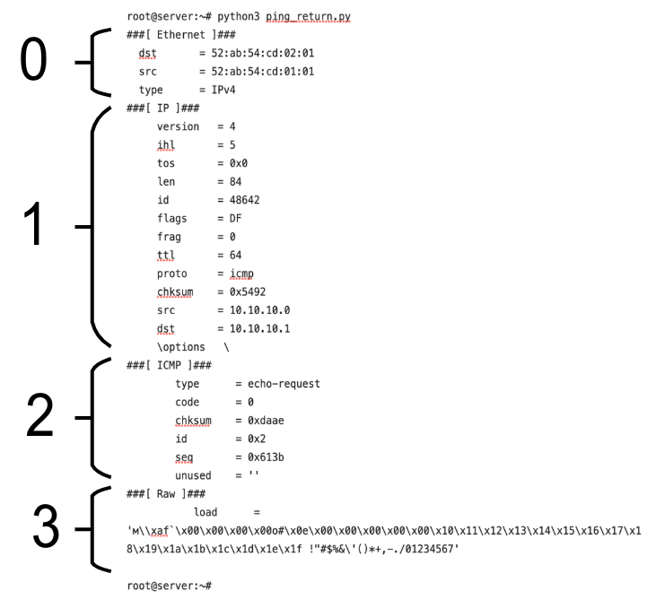
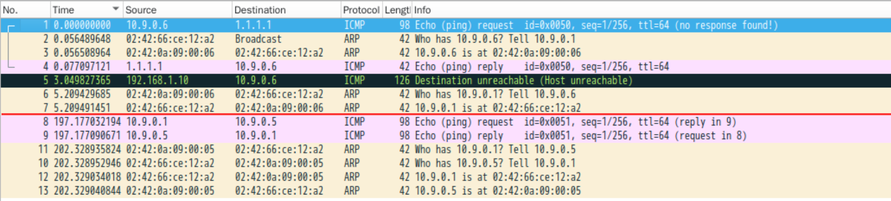

## 前言

该任务需要做的是当外来主机向你发送 ICMP 包的时候，总能显示匹配成功

好比说外来主机对着连通你这台机子的网卡接口 ping 任意地址，都能得到主机存活的状态

ICMP 连通的基本操作是：主机 IP 发送一个 ICMP 类型 8（回显请求）数据包，收到一个 ICMP 类型 0（回显应答）的包表示机器存活

**ICMP 类型**

|   回显请求   |   回显应答   | 目标不可达 |
|    :---:    |    :--:    |    :--:    |
| echo-request | echo-reply | destination-unreachable |
|      8      |      0      |      3      |

首先编写一个随机 IP 发送 ICMP 报文的脚本，用于搭建模拟环境，将其放置在 IP 段为 `10.9.0.6` 的 docker 容器内

```python
#!/usr/bin/env python3
# -*- coding: utf-8 -*-
import scapy.all as scapya
import time

ap = scapya.IP(dst=scapya.RandIP(), src="10.9.0.100")/scapya.ICMP(type="echo-request")
while 1:
    scapya.send(ap, iface="eth0")
    time.sleep(1)

```

该脚本的主要作用是模拟同一网络下的外部人员访问当前设备内部网络时发出的 ICMP 请求包

伪造目的 IP （要访问的）地址为任意地址，源 IP 地址可以填写为本机网卡接口可以分配的 IP 地址，但不是本机 IP 地址

ICMP 的发送接手源码可以参考一些开源内核项目的实现，例如：

- https://github.com/StevenBaby/onix/blob/dev/src/net/icmp.c
- https://github.com/StevenBaby/onix/blob/dev/src/include/onix/net/icmp.h
- https://elixir.bootlin.com/linux/latest/source/net/ipv4/icmp.c

## 第一次尝试

```python
#!/usr/bin/env python3
# -*- coding: utf-8 -*-
import scapy.all as scapya
import fcntl
import socket
import binascii
import time

SIOCGIFNETMASK = 0x891b
g_iface = "br-2013ee70fe72"
# 该样例子网掩码的获取方式：不发送 ICMP 请求源 IP 地址的子网掩码，仅从绑定的网卡接口粗略判断
g_subnet_mask: str = socket.inet_ntoa(fcntl.ioctl(socket.socket(socket.AF_INET, socket.SOCK_DGRAM), SIOCGIFNETMASK, g_iface.encode().ljust(0x100, b'\x00'))[20:24])
g_mask: int = socket.ntohl(int(binascii.hexlify(socket.inet_aton(g_subnet_mask)), 16))


# 判断是否为广播地址
def ip_addr_isbroadcast(_ip: str) -> bool:
    _a: int = socket.ntohl(int(binascii.hexlify(socket.inet_aton(_ip)), 16))
    return (_a == 0xffffffff) or (_a == 0) or ((_a & ~g_mask) == (0xffffffff & (~g_mask)))


# 判断是否为组播地址
def ip_addr_ismulticast(_ip: str) -> bool:
    _a: int = socket.ntohl(int(binascii.hexlify(socket.inet_aton(_ip)), 16))
    return (_a & socket.ntohl(0xF0000000)) == socket.ntohl(0xE0000000)


def func_pkt(pkt):
    sig = "%-18f " % (time.time())
    # 判断是否为发送 echo-request 的 ICMP 报文
    if pkt.haslayer(scapya.ICMP) and pkt[0][2].type == 8:
        dst = pkt[0][1].dst
        if ip_addr_isbroadcast(dst):
            print(sig + pkt.summary() + " (broadcast)")
        elif ip_addr_ismulticast(dst):
            print(sig + pkt.summary() + " (multicast)")
        else:
            print(sig + pkt.summary())
            ap = scapya.IP(dst=pkt[0][1].src, src=dst)/scapya.ICMP(type="echo-reply", id=pkt[0][2].id, seq=pkt[0][2].seq)
            scapya.send(ap, iface=g_iface)
    else:
        print(sig + pkt.summary())


scapya.sniff(iface=g_iface, prn=func_pkt)

```

其中我判断了广播和组播的 IP，并将其进行了过滤

`pkt[0][1].dst` 的意思如下图所示，我们默认 `pkt[0]` 为该数据包的整体，在此 ICMP 案例中，与之对应的是

- `pkt[0][scapya.Ether]` == `pkt[0][0]`
- `pkt[0][scapya.IP]` == `pkt[0][1]`
- `pkt[0][scapya.ICMP]` == `pkt[0][2]`
- `pkt[0][scapya.Raw]` == `pkt[0][3]`

注：此处的 scapya 来源于 `import scapy.all as scapya`



虽然该代码可以接收我的案例脚本所发的 ICMP 请求包并返回，但是落实在实际的 ping 命令中就会爆出错误，如下

```css
1699286269.811590  Ether / IP / ICMP 10.9.0.6 > 1.1.1.1 echo-request 0 / Raw
.
Sent 1 packets.
1699286269.921238  Ether / ARP who has 10.9.0.6 says 10.9.0.1
1699286269.922038  Ether / ARP is at 02:42:0a:09:00:06 says 10.9.0.6
1699286269.922781  Ether / IP / ICMP 1.1.1.1 > 10.9.0.6 echo-reply 0
1699286272.862197  Ether / IP / ICMP 192.168.1.10 > 10.9.0.6 dest-unreach host-unreachable / IPerror / ICMPerror / Raw
1699286275.021081  Ether / ARP who has 10.9.0.1 says 10.9.0.6
1699286275.021322  Ether / ARP is at 02:42:66:ce:12:a2 says 10.9.0.1
```

抓包得出如下结果



## 第二次尝试

后来比对数据包发现，我的 icmp-reply 请求里少了 Raw 的字段，也就是时间戳和消息，补上后如下所示

```python
#!/usr/bin/env python3
# -*- coding: utf-8 -*-
import scapy.all as scapya
import fcntl
import socket
import binascii
import time

SIOCGIFNETMASK = 0x891b
g_iface = "br-2013ee70fe72"
# 该样例子网掩码的获取方式：不发送 ICMP 请求源 IP 地址的子网掩码，仅从绑定的网卡接口粗略判断
g_subnet_mask: str = socket.inet_ntoa(fcntl.ioctl(socket.socket(socket.AF_INET, socket.SOCK_DGRAM), SIOCGIFNETMASK, g_iface.encode().ljust(0x100, b'\x00'))[20:24])
g_mask: int = socket.ntohl(int(binascii.hexlify(socket.inet_aton(g_subnet_mask)), 16))


# 判断是否为广播地址
def ip_addr_isbroadcast(_ip: str) -> bool:
    _a: int = socket.ntohl(int(binascii.hexlify(socket.inet_aton(_ip)), 16))
    return (_a == 0xffffffff) or (_a == 0) or ((_a & ~g_mask) == (0xffffffff & (~g_mask)))


# 判断是否为组播地址
def ip_addr_ismulticast(_ip: str) -> bool:
    _a: int = socket.ntohl(int(binascii.hexlify(socket.inet_aton(_ip)), 16))
    return (_a & socket.ntohl(0xF0000000)) == socket.ntohl(0xE0000000)


def func_pkt(pkt):
    sig = "%-18f " % (time.time())
    # 判断是否为发送 echo-request 的 ICMP 报文
    if pkt.haslayer(scapya.ICMP) and pkt[0][2].type == 8:
        dst = pkt[0][1].dst
        if ip_addr_isbroadcast(dst):
            print(sig + pkt.summary() + " (broadcast)")
        elif ip_addr_ismulticast(dst):
            print(sig + pkt.summary() + " (multicast)")
        else:
            print(sig + pkt.summary())
            _IP = scapya.IP(dst=pkt[0][1].src, src=dst)
            _ICMP = scapya.ICMP(
                type="echo-reply",
                id=pkt[0][2].id,
                seq=pkt[0][2].seq,
            )
            #! NEW CODE IS HERE
            _RAW = pkt[0][3]
            scapya.send(_IP/_ICMP/_RAW, iface=g_iface)
    else:
        print(sig + pkt.summary())


scapya.sniff(iface=g_iface, prn=func_pkt)

```

ping 命令会显示可以收到 icmp-reply 包，如果只是 ping 低于 3 次，那么大概率不会报错

```shell
# ping -c 4 -I eth0 1.1.1.1
PING 1.1.1.1 (1.1.1.1) from 10.9.0.6 eth0: 56(84) bytes of data.
64 bytes from 1.1.1.1: icmp_seq=1 ttl=64 time=30.6 ms
64 bytes from 1.1.1.1: icmp_seq=2 ttl=64 time=27.3 ms
64 bytes from 1.1.1.1: icmp_seq=3 ttl=64 time=13.0 ms
64 bytes from 1.1.1.1: icmp_seq=4 ttl=64 time=23.0 ms

--- 1.1.1.1 ping statistics ---
4 packets transmitted, 4 received, 0% packet loss, time 3005ms
rtt min/avg/max/mdev = 13.014/23.475/30.574/6.603 ms
```

ping 的循环次数大于 3 次后，那么大概率会和我们的伪造程序一样，依旧会报 `dest-unreach host-unreachable`

```shell
# ping -c 6 -I eth0 1.1.1.1
PING 1.1.1.1 (1.1.1.1) from 10.9.0.6 eth0: 56(84) bytes of data.
64 bytes from 1.1.1.1: icmp_seq=1 ttl=64 time=41.6 ms
64 bytes from 1.1.1.1: icmp_seq=2 ttl=64 time=35.2 ms
64 bytes from 1.1.1.1: icmp_seq=3 ttl=64 time=41.9 ms
From 192.168.1.10 icmp_seq=1 Destination Host Unreachable
From 192.168.1.10 icmp_seq=2 Destination Host Unreachable
From 192.168.1.10 icmp_seq=3 Destination Host Unreachable

--- 1.1.1.1 ping statistics ---
3 packets transmitted, 3 received, +3 errors, 0% packet loss, time 2011ms
rtt min/avg/max/mdev = 35.226/39.589/41.937/3.088 ms, pipe 3
```

## 第三次尝试

### 思路

其实第二次尝试就已经完成了 ICMP 的伪造，只是 Scapy 嗅探数据包时不会干扰主机的 IP 栈，不能丢弃任意数据包

就是说 ICMP 包会报错说找不到 HOST 是因为我们没能拦截这个包，使其不进入内核，导致内核处理后返回了这个 ICMP 的 Host Unreachable 包

所以我们第二次尝试成功的部分其实是抢在了内核处理该 ICMP 包之前返回了 ICMP 的 echo-reply 包

那么想要完全不报错也不是不行，要么搞个网卡接口劫持，把 ICMP 包全劫持了，不允许内核处理该网卡的 ICMP 包

要么在机子里选个网卡接口加被 ping 的 IP，完事儿后再删掉就行

这样内核处理 ICMP 请求的时候，发现 IP 属于该机子上的某个网卡接口，能给 IP 找到家，那么就不会报这个错了

最方便添加处理的网卡接口是 lo 接口，毕竟人家常年用 127.0.0.1

### 脚本

```python
#!/usr/bin/env python3
# -*- coding: utf-8 -*-
import scapy.all as scapya
import binascii
import pyroute2
import socket
import fcntl
import time

SIOCGIFNETMASK = 0x891b
g_iface = "br-2013ee70fe72"
# 该样例子网掩码的获取方式：不发送 ICMP 请求源 IP 地址的子网掩码，仅从绑定的网卡接口粗略判断
g_subnet_mask: str = socket.inet_ntoa(fcntl.ioctl(socket.socket(socket.AF_INET, socket.SOCK_DGRAM), SIOCGIFNETMASK, g_iface.encode().ljust(0x100, b'\x00'))[20:24])
g_mask: int = socket.ntohl(int(binascii.hexlify(socket.inet_aton(g_subnet_mask)), 16))
# new ideas
configured_ips = []
ipr = pyroute2.IPRoute()


# 判断是否为广播地址
def ip_addr_isbroadcast(_ip: str) -> bool:
    _a: int = socket.ntohl(int(binascii.hexlify(socket.inet_aton(_ip)), 16))
    return (_a == 0xffffffff) or (_a == 0) or ((_a & ~g_mask) == (0xffffffff & (~g_mask)))


# 判断是否为组播地址
def ip_addr_ismulticast(_ip: str) -> bool:
    _a: int = socket.ntohl(int(binascii.hexlify(socket.inet_aton(_ip)), 16))
    return (_a & socket.ntohl(0xF0000000)) == socket.ntohl(0xE0000000)


def add_interface_ip(interface_name, ip_address):
    interface_index_id = ipr.link_lookup(ifname=interface_name)[0]
    ipr.addr("add", index=interface_index_id, address=ip_address, prefixlen=32)


def delete_interface_ip(interface_name, ip_address):
    interface_index_id = ipr.link_lookup(ifname=interface_name)[0]
    ipr.addr("delete", index=interface_index_id, address=ip_address, prefixlen=32)


def cleanup_ips(interface_name):
    interface_index_id = ipr.link_lookup(ifname=interface_name)[0]
    interface_addresses = ipr.get_addr(index=interface_index_id, family=2)
    for address in interface_addresses:
        ip = address.get_attrs("IFA_ADDRESS")[0]
        if ip != "127.0.0.1":
            print("Cleanup - Deleting IP address %s from interface %s" % (ip, interface_name))
            delete_interface_ip(interface_name, ip)


def func_pkt(pkt):
    sig = "%-18f " % (time.time())
    # 判断是否为发送 echo-request 的 ICMP 报文
    if pkt.haslayer(scapya.ICMP) and pkt[0][2].type == 8:
        dst = pkt[0][1].dst
        if ip_addr_isbroadcast(dst):
            print(sig + pkt.summary() + " (broadcast)")
        elif ip_addr_ismulticast(dst):
            print(sig + pkt.summary() + " (multicast)")
        elif dst not in configured_ips:
                src = pkt[0][1].src
                configured_ips.append(dst)
                print("Received an ICMP echo request from source %s with a destination of %s" % (src, dst))
                add_interface_ip("lo", dst)
    else:
        print(sig + pkt.summary())


scapya.sniff(iface=g_iface, prn=func_pkt)
cleanup_ips("lo")

```

## 参考链接

- https://www.dasblinkenlichten.com/packet-actions-python-and-scapy/
